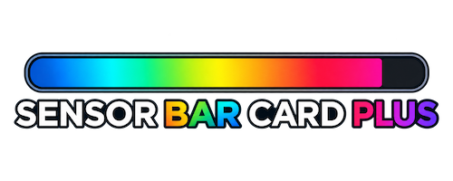
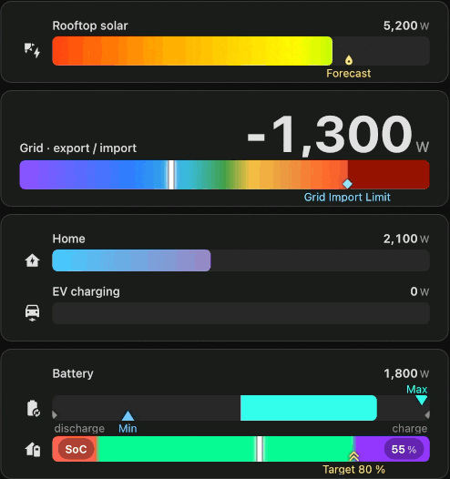
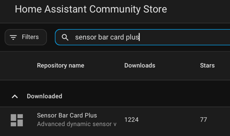

# Sensor Bar Card Plus

[](https://github.com/hacs/integration)
[](https://github.com/cdelaet/sensor-bar-card-plus/releases)
[](https://github.com/cdelaet/sensor-bar-card-plus/actions/workflows/validate.yml)
[](https://github.com/cdelaet/sensor-bar-card-plus/blob/main/LICENSE)

Sensor Bar Card Plus (SBCP) presents numeric sensor values as configurable bars or gauges in Home Assistant dashboards. Use it as a standalone card or as a native Card Feature inside a Tile card. It is useful when a value needs visual context: its scale, operating range, target, recent extrema, or relationship to a neutral point.



Both presentations support structured YAML, animated reveal fills, Needle gauges, five fill styles, dynamic Scales, Baseline fill origins, Target/Peak/Floor and Reference Markers, and a Visual Editor. The standalone card also supports multiple entities, five label layouts including Hero, per-entity overrides, and responsive row content.

Now you have no excuse not to build that pretty dashboard. Go forth and dash those boards. -Chris (with unapologetic dadhumor)

## Install

### HACS

1. Open **HACS** in Home Assistant.
2. Search for **Sensor Bar Card Plus** and select **Download**.
3. Refresh your browser.



### Manual

1. Download `sensor-bar-card-plus.js` from the [latest release](https://github.com/cdelaet/sensor-bar-card-plus/releases).
2. Copy it to `/config/www/`.
3. Under **Settings → Dashboards → Resources**, add `/local/sensor-bar-card-plus.js` as a JavaScript module.
4. Refresh your browser.

## Your first card

This example shows a power sensor on a 0–3000 W scale, with a gradient fill and a 2500 W target:

~~~yaml
type: custom:sensor-bar-card-plus
title: Caravan Power
layout:
  label:
    position: left
scale:
  min:
    fixed: 0
  max:
    fixed: 3000
formatting:
  unit: W
target:
  at:
    fixed: 2500
  label:
    show: true
bar:
  fill_style: gradient
entities:
  - entity: sensor.caravan_power
    name: Caravan
    icon: mdi:caravan
~~~

The filled track moves with the sensor reading, while the target marks the configured threshold. Change the entity and scale to fit your sensor. You can create the card from the Home Assistant card picker and edit the same configuration in the Visual Editor.


## Card Feature

New in v1.8.0, the native Home Assistant Card Feature puts a compact SBCP Bar inside a Tile card, in either Bottom or Inline placement. The same installed `sensor-bar-card-plus.js` resource provides both presentations; **no second JavaScript resource is needed**.

Add **Sensor Bar Card Plus** in the Tile's feature picker and configure it with the Visual Editor, or use Tile YAML:

```yaml
type: tile
entity: sensor.house_power
features:
  - type: custom:sensor-bar-card-plus-feature
    scale:
      min: { fixed: 0 }
      max: { fixed: 3000 }
```

The Feature inherits the Tile's entity when its own `entity` is omitted. An optional `entity: sensor.other_power` inside the Feature overrides that source; the inherited Tile entity is never written into Feature YAML. Use singular `entity`, not `entities`.

The Feature reuses SBCP's Scale, Bar, Segments, Gradient Stops, Needle, Baseline, marker and formatting configuration where applicable. It shows the Bar and compact marker labels; title, multi-row Layouts, Hero and primary-value presentation belong to the standalone card or parent Tile. See [Card Feature Configuration](docs/configuration.md#card-feature-configuration) for applicability and [Card Feature examples](docs/examples.md#card-feature) for complete Tile configurations.

## How a card works

Each standalone card row starts with a sensor value. SBCP compares that value with the row’s effective minimum and maximum to place it on a scale. Those bounds, Baseline, Target, and generic marker values can use live Home Assistant entities as sources. The track represents the scale; the fill or Needle shows the current value. Peak and Floor show observed extrema. Baseline changes where a reveal fill begins. Labels and layout determine how the value and its context fit around the track.

Card settings provide defaults for supported row settings. Entity rows can override layout, scale, bar, Baseline, Target, Peak, Floor, generic markers, and formatting; card-only settings such as `title` and `entities` are not row overrides. Lists such as markers replace the inherited list. See [Configuration: scope and inheritance](docs/configuration.md#scope-inheritance-and-replacement) for the detailed rules.

## Rendering and fill styles

### Reveal fill

Reveal fill runs from its fill origin to the current value. By default, the origin is the scale minimum; when Baseline is active, it becomes the fill origin. Reveal fill works well for progress, usage, charge, and other quantities where the amount filled is meaningful.

### Needle

Needle mode keeps the full track visible and places a moving indicator at the current value. Use it when the full scale and its color regions should remain visible, even at low readings. Needle and Baseline are distinct rendering models; Needle does not use Baseline fill geometry.

### Fill styles

The fill style controls how the track is colored:

- `solid` uses one color.
- `gradient` blends configured colors across the scale.
- `bands` changes color at segment boundaries.
- `soft_bands` blends across short transitions between segments.
- `band_gradient` creates a continuous gradient from segment colors.

`solid_fill` samples the active color at the current value and uses it uniformly across the revealed fill, which is useful if you want the fill color to change based on the current value.

Segment boundaries can describe percentages of the track or values on the configured scale. The [configuration reference](docs/configuration.md#fill-styles-reference) has the detailed options and defaults.


## Layouts

The standalone card offers these label positions:

- **Left** keeps a label beside each bar and works well for aligned multi-row cards.
- **Above** puts the label above the track, useful when the left column is tight.
- **Inside** places the label within the track.
- **Off** leaves the bar without a name label.
- **Hero** gives the value more prominence for a glanceable gauge or KPI.

The card can adapt supporting labels and icons as width changes. Hero gives the value priority; standard layouts preserve useful room for the track and may hide supporting details in tight spaces. Explicit row height remains respected, and very dense or narrow layouts can still have edge cases. Exact sizing and responsive configuration are in [Layout](docs/configuration.md#layout-options-and-responsive-behavior).

## Baseline: fill from a reference point

**Baseline controls where the fill begins. It is not a marker type.**

A baseline can be placed anywhere on the scale. The bar fills outward from that value rather than from scale.min, making it useful for any measurement with a meaningful reference point, such as zero for import/export power or 32 °F for freezing/thawing temperatures.

~~~yaml
scale:
  min:
    fixed: -3000
  max:
    fixed: 3000
baseline:
  at:
    fixed: 0
  above:
    color: '#22c55e'
  below:
    color: '#3b82f6'
entities:
  - entity: sensor.grid_power
    name: Grid exchange
~~~

Baseline does not change the scale or the meaning of its values. Its full field reference is in [Baseline](docs/configuration.md#baseline).

## Markers: targets, extrema and references

Markers add values worth seeing against a row’s scale. They do not set the fill origin; use Baseline when the fill should begin from a reference point.

### Target

Target is a configured threshold or reference. It supports fixed, percentage, and entity-driven values, including existing dynamic behavior. Its default shape is Diamond. Set `target.shape: triangle` to keep the former triangle appearance. Target labels and above-target fill color are optional.

### Peak and Floor

Peak tracks the highest finite value observed for the card row; Floor tracks the lowest. They complement each other by showing the observed range. Their values are runtime/session state held by each card row or Card Feature instance, not durable historical statistics, and are lost when that instance or browser is recreated. Each can be reset using supported duration or local calendar policies; see [Peak and Floor reset behavior](docs/configuration.md#peak-and-floor-reset-behavior).

### Generic Reference Markers

Use `markers` for configured references that are not Target thresholds or observed extrema. A marker can use a fixed value, a percentage of the effective scale, an entity value, or an entity with a fixed fallback. For example, the following row shows a forecast reference and an entity-driven trigger:

```yaml
markers:
  - at: 65%
    lane: above
    shape: arrow
    color: '#38bdf8'
    label:
      show: true
      text: Forecast
  - at:
      entity: sensor.warning_threshold
      fixed: 2400
    shape: pin
    direction: outward
    color: '#f59e0b'
    label:
      show: true
      text: Trigger
entities:
  - entity: sensor.grid_power
    name: Grid
```

Markers can occupy the `above` or `below` lane. Their shapes are Circle, Diamond, Triangle, Chevron, Arrow, and Pin. Direction (`inward` or `outward`) affects directional shapes; Circle and Diamond do not change with direction. Marker color and labels can distinguish a forecast, reserve, comfort bound, or other reference.

Up to four markers can appear above the bar and four below it. Peak uses an above slot; Floor and Target use below slots. A marker label can display a different entity with `label.entity`, and `show_marker: false` makes it a label-only information anchor that still uses a slot. In the standalone card, nearby labels can overlap; hovering a marker on pointer-based devices brings its label to the front. Card Feature labels adapt to available width without hover promotion. For units, unavailable states, inheritance, clamping, and full syntax, see [Generic Reference Markers](docs/configuration.md#generic-reference-markers).

## Practical examples

The [recipe catalogue](examples/recipes/README.md) contains copyable dashboard patterns with descriptions of when they fit. A few starting points:

- **Grid import/export** and **battery flow** use Baseline to show movement on either side of zero: [grid import/export](examples/recipes/energy/grid-import-export.yaml), [battery flow](examples/recipes/energy/battery-flow.yaml), and [bidirectional power](examples/recipes/baseline/bidirectional-power.yaml).
- **Solar production** and **EV charging** show positive power and household demand: [solar production](examples/recipes/energy/solar-production.yaml) and [EV charging](examples/recipes/energy/ev-charging.yaml).
- **Server health**, **network latency**, and **dense telemetry** demonstrate compact operational dashboards: [server health](examples/recipes/telemetry/server-health.yaml), [network latency](examples/recipes/telemetry/network-latency.yaml), and [dense AV telemetry](examples/recipes/telemetry/dense-av-telemetry.yaml).
- [Needle basics](examples/recipes/gauges/needle-gauge-basics.yaml) and [Needle with soft bands](examples/recipes/gauges/needle-soft-bands.yaml) keep the whole scale in view.

The interactive Playground brings feature combinations together in larger working examples; the Heritage dashboard compares legacy and structured configurations.

## Visual Editor

Both presentations have a Home Assistant Visual Editor and live preview. The standalone editor configures entity rows and Layout as well as Scale, Bar and markers. The Card Feature editor offers the applicable shared sections: Entities, Scale, Markers, Bar Appearance, Segments, Gradient Stops and Formatting, with parent-entity inheritance or an explicit override.

Target, Peak, Floor, Generic Reference Markers, and individual generic markers have collapsible editor groups. Baseline is configured under **Bar Appearance**; entity-level Baseline remains with the standalone entity overrides. The editor keeps its local disclosure state out of saved YAML. You can continue editing the same structured configuration manually at any time.


## Responsive behavior and data details

The standalone card adapts label and icon placement to available width, while keeping the bar and value useful where possible. Click or tap an entity row to open Home Assistant’s standard more-info dialog. If an entity is missing, its row shows an error while other rows remain available. Dynamic scales and reference values update as their source entities change. When a primary reading is unknown or unavailable, the card cannot place a new numeric value; Peak and Floor retain the last finite sample until reset or reconfiguration.

Peak and Floor are session state rather than long-term history. Standalone marker labels can overlap when references are close together. Compact Card Feature labels shorten or hide according to available width; full resolved marker information remains in the accessible description. A dynamic marker’s source unit is not converted to the displayed unit. These details and other boundary behavior are covered in the [configuration reference](docs/configuration.md).

## Compatibility

Existing standalone dashboards do not require a configuration migration for v1.8.0. Target’s default appearance changed to Diamond; set `target.shape: triangle` to retain the former triangle. Legacy flat configuration remains supported. See [Legacy compatibility and migration](docs/configuration.md#legacy-compatibility-and-migration) for aliases and the converter.

## Documentation and examples

- [Configuration Reference](docs/configuration.md) — shared syntax, options, defaults, and Card Feature applicability.
- [Examples Guide](docs/examples.md) — compare layouts, fills, and references with focused, copyable YAML.
- [Recipe Catalogue](examples/recipes/README.md) — practical, copyable configurations for common use cases.
- [Example Dashboards](examples/dashboards/sensor-bar-card-plus-playground.yaml) — larger working configurations and feature demonstrations in the interactive Playground.
- [Contributor and development guide](CONTRIBUTING.md)

## About, support and license

Sensor Bar Card Plus was inspired by [Sensor Bar Card by TommySharpNZ](https://github.com/TommySharpNZ/sensor-bar-card). SBCP uses its own card type (`custom:sensor-bar-card-plus`) and resource path (`/local/sensor-bar-card-plus.js`), so both cards can coexist.

If SBCP improves your Home Assistant dashboard, you can [support continued development on Ko-fi](https://ko-fi.com/chrisdelaet).

Licensed under the [MIT License](LICENSE).
