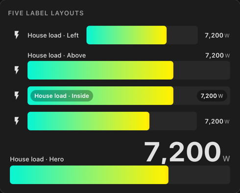
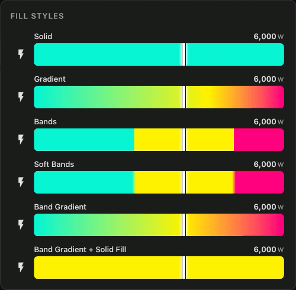
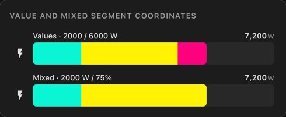
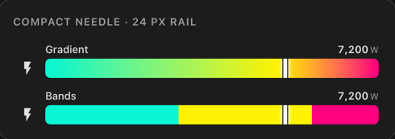
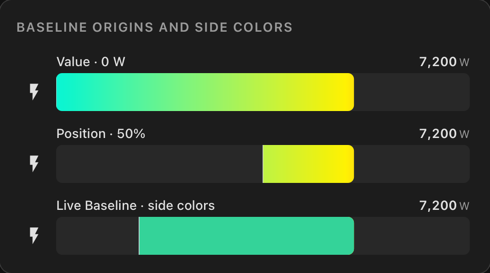
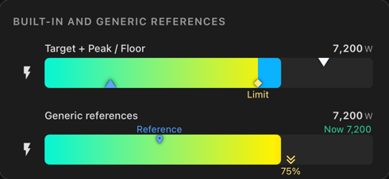
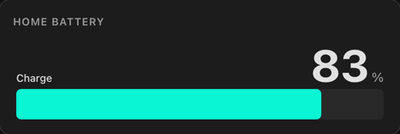
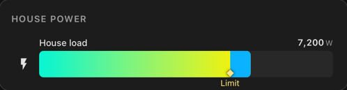
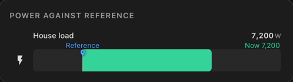

# Examples Guide

These practical examples show useful Sensor Bar Card Plus combinations rather than every option. Replace the example entity IDs with your own entities and adjust the Scale to match their values. The card uses the sensor's unit by default; it does not convert values between units. The [Configuration Reference](configuration.md) covers all options, defaults, and advanced behavior.

The comparisons follow the **Visual Examples** view in the [example dashboard](../examples/dashboards/sensor-bar-card-plus-screenshots.yaml). To try its live controls, load the [playground package](../examples/packages/sensor_bar_card_plus_playground_package.yaml) as well. The comparison sensor is `sensor.sbcp_examples_primary`, initially **7200 W** on a **0–10000 W** Scale. The fixed-Scale cards below also work with your own power sensor without those helpers.

Each YAML block is a complete card unless introduced as a replacement or an addition to an existing card.

## Label Layouts

| Layout | Use it when… | Tradeoff |
|---|---|---|
| Left | Several named metrics should line up beside their rails. | The label column consumes horizontal space; the reading may move above. |
| Above | Text should stay clear of the fill and references. | The name and reading header adds height. |
| Inside | Compact rows matter more than an unobstructed rail. | Name and reading pills cover some rail detail. |
| Off | A surrounding title already identifies the metric. | No name is displayed; the icon and reading can still provide context. |
| Hero | One prominent reading should be easy to scan. | Larger typography needs room and shrinks to fit. |

**Hero does not display an entity icon.** This is intentional at every width. The other layouts can show an entity icon and may hide it responsively when space is constrained. Use `icon: false` on a row to remove it explicitly.

This comparison repeats the same sensor so only the layout changes. Leave rail height implicit to let responsive density adapt.



```yaml
type: custom:sensor-bar-card-plus
title: Five Label Layouts
layout:
  label: { position: left, width: 150 }
scale:
  min: { fixed: 0 }
  max: { fixed: 10000 }
formatting: { decimal: 0 }
bar:
  fill_style: gradient
  gradient_stops:
    - { pos: 0, color: "#00F5D4" }
    - { pos: 70, color: "#FFF200" }
    - { pos: 100, color: "#FF007F" }
entities:
  - entity: sensor.sbcp_examples_primary
    name: House load · Left
  - entity: sensor.sbcp_examples_primary
    name: House load · Above
    layout: { label: { position: above } }
  - entity: sensor.sbcp_examples_primary
    name: House load · Inside
    layout: { label: { position: inside } }
  - entity: sensor.sbcp_examples_primary
    layout: { label: { position: 'off' } }
  - entity: sensor.sbcp_examples_primary
    name: House load · Hero
    layout:
      label: { position: hero }
      hero: { size: small }
```

See [Layout Options and Responsive Behavior](configuration.md#layout-options-and-responsive-behavior) for fitting and sizing details.

## Fill styles

Needle paints the full rail and indicates the current value. This keeps every color region visible, even at a low reading, making the fill styles easier to compare.

The shared palette is cyan **#00F5D4**, yellow **#FFF200**, and magenta **#FF007F**. Gradient stops sit at **0%, 70%, and 100%**. Segment ranges are **0–40%, 40–80%, and 80–100%**.



```yaml
type: custom:sensor-bar-card-plus
title: Fill Styles
layout: { label: { position: above } }
scale:
  min: { fixed: 0 }
  max: { fixed: 10000 }
formatting: { decimal: 0 }
bar:
  color: "#00F5D4"
  needle: { show: true, color: "#F8FAFC" }
  gradient_stops:
    - { pos: 0, color: "#00F5D4" }
    - { pos: 70, color: "#FFF200" }
    - { pos: 100, color: "#FF007F" }
  segments:
    - { from: 0%, to: 40%, color: "#00F5D4" }
    - { from: 40%, to: 80%, color: "#FFF200" }
    - { from: 80%, to: 100%, color: "#FF007F" }
entities:
  - entity: sensor.sbcp_examples_primary
    name: Solid
    bar: { fill_style: solid }
  - entity: sensor.sbcp_examples_primary
    name: Gradient
    bar: { fill_style: gradient }
  - entity: sensor.sbcp_examples_primary
    name: Bands
    bar: { fill_style: bands }
  - entity: sensor.sbcp_examples_primary
    name: Soft Bands
    bar: { fill_style: soft_bands }
  - entity: sensor.sbcp_examples_primary
    name: Band Gradient
    bar: { fill_style: band_gradient }
  - entity: sensor.sbcp_examples_primary
    name: Band Gradient + Solid Fill
    bar: { fill_style: band_gradient, solid_fill: true }
```

- **Solid** stays cyan regardless of the reading.
- **Gradient** blends between its percentage stops.
- **Bands** keeps hard boundaries between Segment colors.
- **Soft Bands** blends briefly at boundaries where neighboring ranges have room.
- **Band Gradient** turns the Segment color sequence into a continuous gradient.
- **Band Gradient + Solid Fill** samples that gradient at the current value and paints the entire Needle rail with the sampled color. The color changes as the value moves; `solid_fill` is a modifier, not a sixth `fill_style` value.

At 7200 W the Needle sits at 72%. Remove `bar.needle` to use ordinary reveal fill from the Scale minimum to the reading instead. See [Fill Styles Reference](configuration.md#fill-styles-reference) for exact color placement and modifiers.

## Scale and Segment coordinates

The cards above use a fixed **0–10000 W** Scale and percentage Segment boundaries. A plain Segment boundary is a **Scale value**: `2000` means 2000 W here. A `%` boundary is a **position across the Scale**: `75%` means 7500 W on this Scale.

This comparison uses value thresholds at 2000/6000 W, then replaces the second threshold with 75%:



```yaml
type: custom:sensor-bar-card-plus
title: Value and Mixed Segment Coordinates
layout: { label: { position: above } }
scale:
  min: { fixed: 0 }
  max: { fixed: 10000 }
formatting: { decimal: 0 }
bar:
  fill_style: bands
  segments:
    - { from: 0%, to: 2000, color: "#00F5D4" }
    - { from: 2000, to: 6000, color: "#FFF200" }
    - { from: 6000, to: 100%, color: "#FF007F" }
entities:
  - entity: sensor.sbcp_examples_primary
    name: Values · 2000 / 6000 W
  - entity: sensor.sbcp_examples_primary
    name: Mixed · 2000 W / 75%
    bar:
      segments:
        - { from: 0%, to: 2000, color: "#00F5D4" }
        - { from: 2000, to: 75%, color: "#FFF200" }
        - { from: 75%, to: 100%, color: "#FF007F" }
```

Changing the maximum to 8000 moves the 2000/6000 W thresholds to 25%/75% of the rail. The mixed row's 75% threshold stays at that fraction and now means 6000 W. **Gradient stops differ:** bare `pos: 70` always means 70%, never 70 W.

For live Scale controls, replace the card's `scale` block with the dashboard's paired sources and complete fixed fallback:

```yaml
scale:
  min:
    entity: input_number.sbcp_examples_scale_min
    fixed: 0
  max:
    entity: input_number.sbcp_examples_scale_max
    fixed: 10000
```

The bounds follow the helpers live. If either source is unavailable, this complete fallback supplies 0–10000 W. See [Scale and live sources](configuration.md#scale-and-dynamic-value-sources) and [Segment boundaries](configuration.md#segment-boundaries) for source and range rules.

## Compact Needle

This Gradient gauge uses an explicit **24 px rail**. The header makes the complete row taller than 24 px. Needle keeps the full colored rail painted and marks the reading instead of revealing a growing fill.



```yaml
type: custom:sensor-bar-card-plus
title: Compact Power Gauge
layout:
  height: 24
  label: { position: above }
scale:
  min: { fixed: 0 }
  max: { fixed: 10000 }
formatting: { decimal: 0 }
bar:
  fill_style: gradient
  needle: { show: true, color: "#F8FAFC" }
  gradient_stops:
    - { pos: 0, color: "#00F5D4" }
    - { pos: 70, color: "#FFF200" }
    - { pos: 100, color: "#FF007F" }
entities:
  - entity: sensor.sbcp_examples_primary
    name: Power
```

Needle works with every fill style and `solid_fill`. An active, resolved Baseline suppresses it. See [Needle](configuration.md#needle).

## Baseline origins and side colors

Ordinary reveal fill starts at the Scale minimum. With Baseline, fill spans **Baseline to the current value**, extending in either direction. A persistent line marks Baseline even when the reading equals it.

Compare a fixed 0 W origin, the visible midpoint, and a live origin with blue below/green above. On this Scale, 50% is 5000 W; if the minimum becomes −2000 W, the midpoint becomes 4000 W while the fixed origin remains 0 W.



```yaml
type: custom:sensor-bar-card-plus
title: Baseline Origins and Side Colors
layout: { label: { position: above } }
scale:
  min: { fixed: 0 }
  max: { fixed: 10000 }
formatting: { decimal: 0 }
bar:
  fill_style: gradient
  gradient_stops:
    - { pos: 0, color: "#00F5D4" }
    - { pos: 70, color: "#FFF200" }
    - { pos: 100, color: "#FF007F" }
entities:
  - entity: sensor.sbcp_examples_primary
    name: Value · 0 W
    baseline: { at: { fixed: 0 } }
  - entity: sensor.sbcp_examples_primary
    name: Position · 50%
    baseline: { at: 50% }
  - entity: sensor.sbcp_examples_primary
    name: Live Baseline · side colors
    baseline:
      at: { entity: input_number.sbcp_examples_baseline, fixed: 2000 }
      below: { color: "#60A5FA" }
      above: { color: "#34D399" }
```

Move the reading below, equal to, and above the live Baseline to see the direction change. These cards use reveal fill; adding Needle would not show it while Baseline resolves. See [Baseline](configuration.md#baseline) for further combinations.

## Target, Peak and Floor

Add these settings to a power card with the 0–10000 W Scale, or to one of its entity rows. The live Target has a fixed 6500 W fallback. Its default Diamond sits below the rail; Peak is an above-lane triangle and Floor is a below-lane triangle.



```yaml
target:
  at: { entity: input_number.sbcp_examples_target, fixed: 6500 }
  color: "#FDE68A"
  label:
    show: true
    text: Limit
    show_value: false
    show_unit: false
  when_exceeded:
    fill_color: "#00B2FF"
peak:
  enabled: true
  color: "#F8FAFC"
floor:
  enabled: true
  color: "#60A5FA"
```

The revealed portion above Target becomes vivid blue **#00B2FF**, distinct from the magenta palette color. Move the reading to 3000 W, then 9000 W, then 7200 W: Peak remains at 9000 and Floor at 3000, assuming no earlier samples outside that range. They track the card session and reset when the card is recreated, rather than providing stored history.

Use just `target`, `peak`, or `floor` when only one reference is needed. See [Target](configuration.md#target-marker), [Peak](configuration.md#peak-marker), [Floor](configuration.md#floor-marker), and [reset behavior](configuration.md#peak-and-floor-reset-behavior).

## Generic references

Add this `markers` block to a power card or entity row. It separates a live inward Pin above the rail, a 75% outward Chevron below, and a label-only endpoint:

```yaml
markers:
  - at: { entity: input_number.sbcp_examples_reference, fixed: 3500 }
    lane: above
    shape: pin
    direction: inward
    color: "#60A5FA"
    label: { show: true, text: Reference, show_value: false, show_unit: false }
  - at: 75%
    lane: below
    shape: chevron
    direction: outward
    color: "#FDE68A"
    label: { show: true, text: '75%', show_value: false, show_unit: false }
  - at: 100%
    lane: above
    show_marker: false
    color: "#34D399"
    label:
      show: true
      text: Now
      entity: sensor.sbcp_examples_primary
      show_unit: false
      precision: 0
```

The Pin follows the reference helper. The Chevron stays at three-quarters of the Scale. **Now** stays anchored at the right endpoint while its label reads the primary sensor independently; `label.entity` changes label content, not position. Replace both the card's primary entity and that label entity when adapting this example.

Labels can overlap when references are close or the card is narrow. Each lane has four slots shared with built-in markers; a label-only reference still consumes one. See [Generic Reference Markers](configuration.md#generic-reference-markers) for capacity and label options.

## Complete practical cards

### Battery percentage at a glance

Use Hero for a prominent battery reading, with a simple cyan reveal fill. Choose a sensor already reporting a percentage.



```yaml
type: custom:sensor-bar-card-plus
title: Home Battery
layout:
  label: { position: hero }
  hero: { size: small }
scale:
  min: { fixed: 0 }
  max: { fixed: 100 }
formatting: { decimal: 0 }
bar: { fill_style: solid, color: "#00F5D4" }
entities:
  - entity: sensor.battery_percent
    name: Charge
```

### House power with a limit

This uses the same Gradient palette and blue exceeded paint as the comparisons. The fixed Target highlights only the revealed part above 6500 W; it does not recolor the whole bar.



```yaml
type: custom:sensor-bar-card-plus
title: House Power
layout: { label: { position: above } }
scale:
  min: { fixed: 0 }
  max: { fixed: 10000 }
formatting: { decimal: 0 }
bar:
  fill_style: gradient
  gradient_stops:
    - { pos: 0, color: "#00F5D4" }
    - { pos: 70, color: "#FFF200" }
    - { pos: 100, color: "#FF007F" }
target:
  at: { fixed: 6500 }
  color: "#FDE68A"
  label: { show: true, text: Limit, show_value: false, show_unit: false }
  when_exceeded: { fill_color: "#00B2FF" }
entities:
  - entity: sensor.house_power
    name: House load
```

### Power relative to a live reference

Baseline shows how far the reading lies above or below a live reference, with the same blue/green side colors as the comparison. A Pin labels that origin; an independent **Now** label shows the reading at the rail endpoint. Use a reference source in the same unit as the power sensor.



```yaml
type: custom:sensor-bar-card-plus
title: Power Against Reference
layout: { label: { position: above } }
scale:
  min: { fixed: 0 }
  max: { fixed: 10000 }
formatting: { decimal: 0 }
bar: { fill_style: solid, color: "#00F5D4" }
baseline:
  at: { entity: input_number.power_reference, fixed: 2000 }
  below: { color: "#60A5FA" }
  above: { color: "#34D399" }
markers:
  - at: { entity: input_number.power_reference, fixed: 2000 }
    lane: above
    shape: pin
    direction: inward
    color: "#60A5FA"
    label: { show: true, text: Reference, show_value: false, show_unit: false }
  - at: 100%
    lane: above
    show_marker: false
    color: "#34D399"
    label: { show: true, text: Now, entity: sensor.house_power, show_unit: false, precision: 0 }
entities:
  - entity: sensor.house_power
    name: House load
```

For more combinations, continue with the [Configuration Reference](configuration.md) or the [recipe catalogue](../examples/recipes/README.md).
